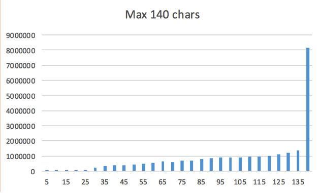
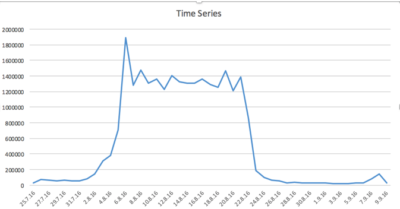

# TWITTER ANALYSIS WITH MAP REDUCE (RIO OLYMPICS)
The goal of this project is to apply Map/Reduce techniques to analyse a dataset of Tweets collected during the 2016 Rio Olympic Games. 
See report.pdf and results.xlsx for full details and code implementation.

### DATASET
The dataset contains a large collection of Twitter messages captured during the Rio 2016 Olympics period. The messages were collected by connecting to Twitter Streaming API, and filtering only messages directly related to the Olympic Games (by requesting they include a related hashtag such as #Rio2016 or #rioolympics ).

### CONTENT ANALYSIS
Histogram that depicts the distribution of tweet lengths (number of characters). To make the data more readable the bars is aggregated in groups of 5 (that is, 1-5, 6-10, and so on).


The average tweetlength is 107 characters. 

### TIME ANALYSIS 
Time series diagram with the number of Tweets that were posted each day of the event.



### HASHTAG ANALYSIS 
During the 2016 Olympics supporters from several countries were expressing their support by adding specific hashtags to its messages, in many cases with the form team__ (e.g. #teamgb). or, go___ (#gousa).
This part of the project estimates what countries received the highest support from Twitter messages. Please note that there will be a strong bias towards English speaking countries, because of the methodology used when collecting the dataset.  

15 Most supported Countries 
```
Brazil	1173700
United States	1154410
United Kingdom	720363
Spain	606649
India	576260
Canada	564023
France	357613
Turkey	342921
Italy	336123
Colombia	235794
Australia	204503
Jamaica	175963
Finland	172946
Guinea	170255
China	161157
```

15 Most popular Hashtags 
```
#BRA	525955
#USA	496897
#TeamUSA	328532
#GBR	295202
#ESP	261850
#CerimoniaDeAbertura	235395
#TeamGB	157069
#CAN	139562
#CHN	136715
#FRA	122420
#TeamCanada	116104
#FinalFive	110735
#IND	102033
#ITA	99725
#espritbleu	99694
```

## Author

* **Christopher Ottesen** 


